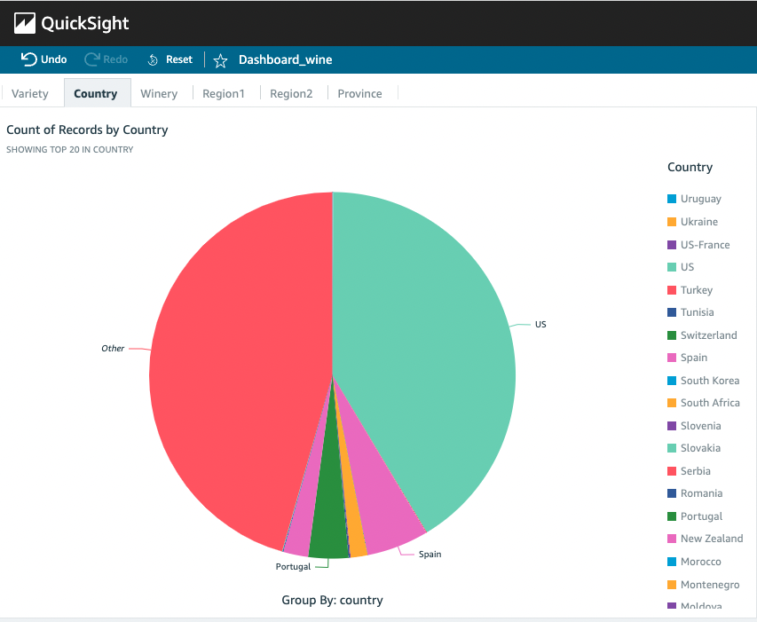

# Data Engineering Project
Data pipeline, ETL, Kaggle, csv, parquet, AWS CLI, AWS cloud, S3, Glue, Athena, QuickSight

## Overview
This was an end-to-end data engineering project from source to destination, using primarily AWS.  At local, data was extracted and transformed from csv file to parquet, using PyArrow. With AWS CLI access in terminal, the file was then uploaded to an S3 bucket. An IAM role was created for Glue Crawler to access the S3 bucket to ascertain the schema and to create a data catalog, namely a table. The data was then viewed in Athena where many ad hoc queries were made.  Finally, QuickSight was used for data visualization and creating a dashboard.

## Architecture of Data Pipeline

## Data Source
The data comes from Kaggle's dataset which has wine reviews. The record count is 150,930. 
The original file size is 49.78 MB.  I used PyArrow to convert the csv file to parquet. In parquet format, the file size is 23.1 MB.
There are 11 columns in the dataset: id, country, description, designation, points, price, province, region_1, region_2, variety, and winery.

Kaggle data can be found here: https://www.kaggle.com/datasets/zynicide/wine-reviews?select=winemag-data-130k-v2.json

Data Engineering class can be found here:  https://github.com/DataTalksClub/data-engineering-zoomcamp

## Data Visualization and Insights from AWS QuickSight

Countries
 

Varieties
 

Provinces

Wine region 1
 

Wine region 2

## Some Questions from Athena Queries

How many countries are in this dataset? 49.

What is the average price of wines for each country? Order the wines within each country by points.

How many wines are from Spain's region of Cava? 100+.

How many wines are from Bulgaria?  77.

What is the max price of wines for each country. Order the wines within each country by points.

What are all the wines from Willamette Valley regions, for region 1 or region 2? 100+.

Calculate the rank of wines in the table according to price within each country.  Provide rank number
by price in descending order by country.

How many wines are Californian Pinot Noir?

Find all wines that are the variety of Cabernet Sauvignon that have a price greater than $20 and points greater than 94.

